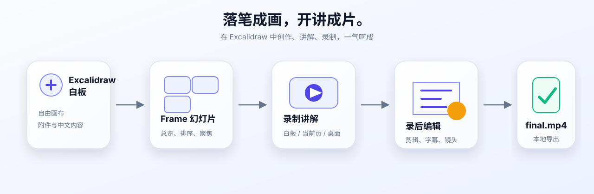
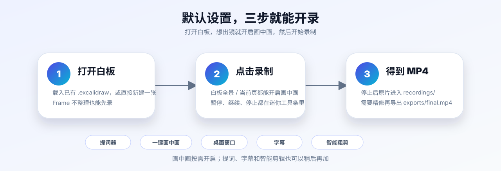

<p align="center">
  
</p>

<h3 align="center">落笔成画，开讲成片。</h3>

<p align="center">
  在 Excalidraw 中创作、讲解、录制，一气呵成。
</p>

<p align="center">
  <a href="#画中画让白板讲解更有人在场">画中画</a> ·
  <a href="#快速开始">快速开始</a> ·
  <a href="#核心体验">核心体验</a> ·
  <a href="#其他真实效果">真实截图</a> ·
  <a href="docs/user-guide.zh-CN.md">使用指南</a> ·
  <a href="CHANGELOG.md">更新日志</a> ·
  <a href="LICENSE">MIT License</a>
</p>

> 当前版本：`v0.1.1` · 面向自托管 Excalidraw

## 画中画，让白板讲解更有“人”在场

只录屏幕，观众能看到内容，却看不到讲解者。对于课程、技术汇报和产品演示，摄像头画中画能保留表情、视线和交流感，让白板讲解更自然，也更容易建立信任。

<p align="center">
  
</p>

`more-excalicord` 把画中画直接放进白板录制流程：

- 开启“摄像头画中画”即可在录制前预览人像；
- 支持左上、左下、右上、右下四角位置，以及形状、大小和镜像调整；
- 可以只作为录制时的屏幕气泡，也可以选择合成进最终视频；
- 白板全景、当前幻灯片和屏幕/窗口录制都能使用同一套讲解配置；
- 摄像头和麦克风仅在用户主动启用并授权后读取。

<p align="center">
  
</p>

上图是实际运行的录制面板：画中画、麦克风、提词器、画幅和录制范围都在同一个界面完成，不需要切换到其他录屏软件。

## 不止画中画，从白板到成片

`more-excalicord` 是面向自托管 Excalidraw 的轻量增强插件：默认设置即可开始录制并生成 MP4；需要时，还可以加入 Frame 幻灯片、提词器、字幕和录后编辑。

<p align="center">
  
</p>

适合用来制作技术方案讲解、课程与培训视频、论文与产品汇报，以及带桌面操作的软件教程。

## 其他真实效果

以下画面来自真实本地运行，不是产品设计稿。

### 一张白板，也能像幻灯片一样讲

<p align="center">
  
</p>

Frame 会成为可搜索、可重命名、可排序的讲解幻灯页。你可以在总览中定位内容，也可以一键回到整张白板的鸟瞰视图。

### 一键录完，也可继续编辑

<p align="center">
  
</p>

剪辑、逐字稿、字幕、镜头、光标、摄像头、画面和音频设置都写入项目时间线；原始录制始终保留。

## 核心体验

| 体验 | 你可以做什么 |
| --- | --- |
| 画中画讲解 | 让讲解者与白板同框，调整四角位置、大小、形状和镜像，并按需合成进视频 |
| 白板即幻灯片 | 用 Frame 组织、搜索、排序和聚焦讲解页，也能随时回到全局鸟瞰 |
| 默认即可录制 | 直接录制白板全景或当前页；需要时再选择桌面窗口和麦克风 |
| 口播更从容 | 使用提词器、柔光补光和可拖动的录制工具条 |
| 录后继续精修 | 非破坏剪辑、逐字稿、字幕、智能镜头与画面包装都不会覆盖原片 |
| 本地项目交付 | 白板、原片、事件、字幕和成片保存在同一项目目录，便于备份与迁移 |

## 默认设置，直接开录

1. 载入或新建一张 Excalidraw 白板。
2. 选择“白板全景”或“当前幻灯片”；希望出镜时，开启“摄像头画中画”和“摄像头合成进视频”。
3. 停止后直接得到原始 MP4；需要精修时，再进入录后编辑并导出 `exports/final.mp4`。

<p align="center">
  
</p>

画中画只需按需开启；Frame 整理、桌面窗口、提词器、字幕和智能剪辑也都不是开始录制的前置条件。

## 快速开始

准备好 Node.js、npm 和一个可运行的自托管 Excalidraw，然后执行：

```bash
git clone https://github.com/bingyunjiang/more-excalicord.git
cd more-excalicord
npm run setup:local
npm run check
npm run deploy:local
```

部署后打开 `http://localhost:5001/`。右侧出现 more-excalicord 工具栏，即可载入[示例白板](examples/more-paper-workflow-video-rich-sketch-20260815.excalidraw)体验。

自定义 Excalidraw 目录、macOS Capture Agent、本地 ASR 和权限配置见[完整安装说明](docs/install.zh-CN.md)。

## 文档与开发

| 我想…… | 从这里开始 |
| --- | --- |
| 尽快用起来 | [快速开始](docs/quickstart.zh-CN.md) · [使用指南](docs/user-guide.zh-CN.md) |
| 完成安装或排障 | [安装说明](docs/install.zh-CN.md) · [排障说明](docs/troubleshooting.zh-CN.md) |
| 了解项目文件 | [项目格式](docs/project-format.zh-CN.md) |
| 参与开发或发布 | [开发指南](docs/developer-guide.zh-CN.md) · [发布检查](docs/release-checklist.zh-CN.md) |
| 查看实测证据 | [v0.1.1 UX 复核](docs/v0.1.1-ux-review.zh-CN.md) |
| 查看版本变化 | [更新日志](CHANGELOG.md) |

## 作者与许可

作者：Dr. Jiang（Bingyun Jiang）<br>
微信：Bingyunjiang · 邮箱：bingyunjiang@qq.com · GitHub：[@bingyunjiang](https://github.com/bingyunjiang)

本项目采用 [MIT License](LICENSE)。
