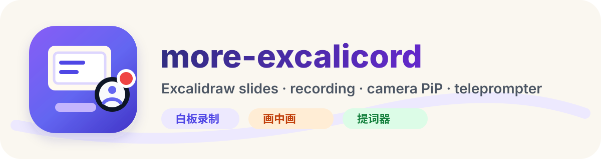
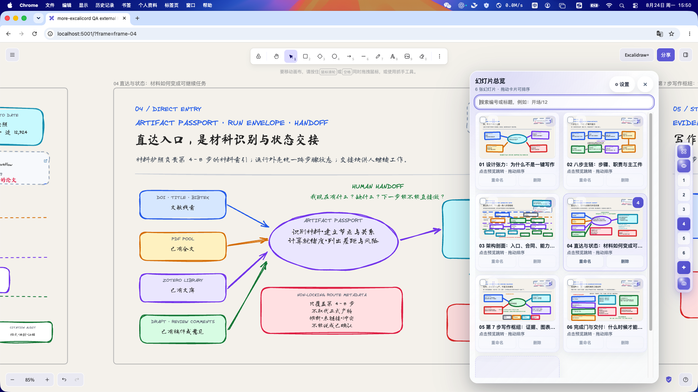
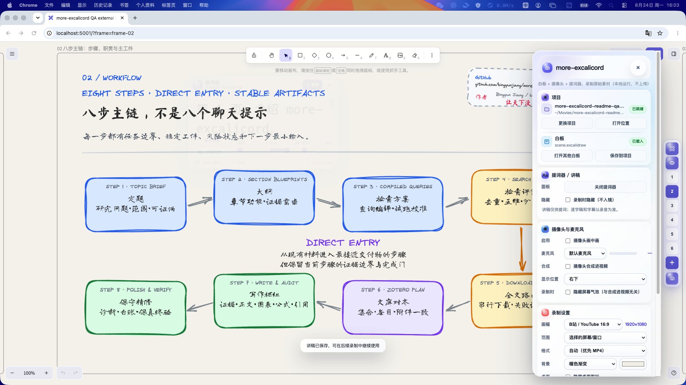
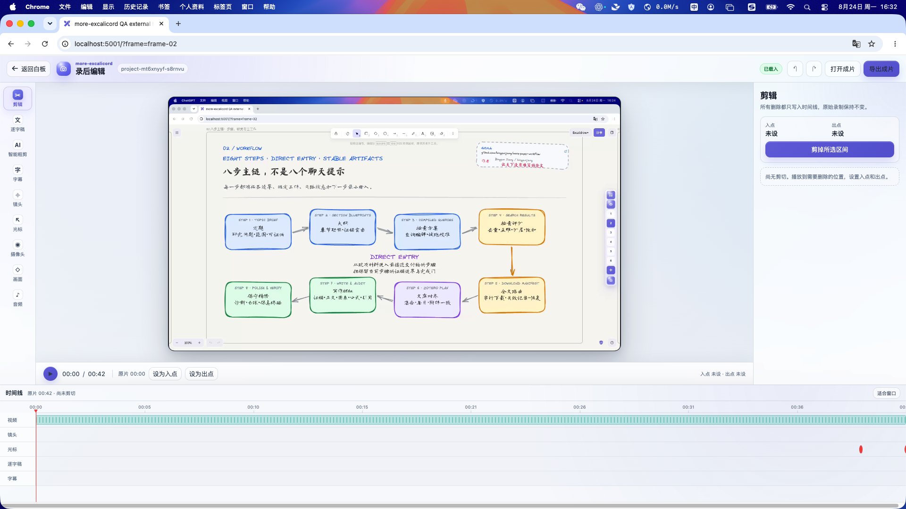
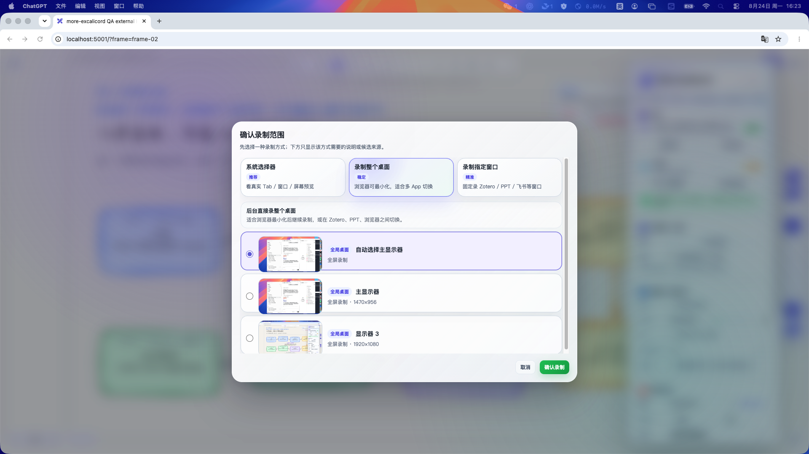
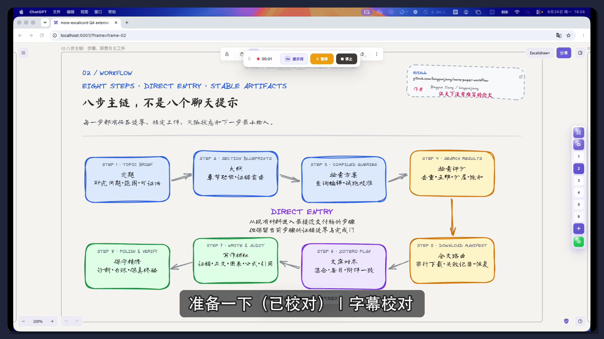

<p align="center">
  
</p>

<h3 align="center">把一张 Excalidraw 白板，变成一套可录制、可剪辑、可交付的视频工作流</h3>

<p align="center">
  Frame 幻灯片 · 白板与桌面录制 · 提词器 · 摄像头画中画 · 字幕 · 非破坏剪辑 · 本地项目
</p>

<p align="center">
  <a href="#快速开始">快速开始</a> ·
  <a href="#它能为你做什么">功能概览</a> ·
  <a href="#真实运行效果">真实截图</a> ·
  <a href="docs/user-guide.zh-CN.md">使用指南</a> ·
  <a href="LICENSE">MIT License</a>
</p>

> 当前版本：`v0.1.1` · 面向 macOS 上的自托管 Excalidraw

## 从白板到成片，不必在多个工具之间来回搬运

Excalidraw 很适合自由思考，却不天然适合按页讲解、稳定录制和后期交付。`more-excalicord` 在你的本地 Excalidraw 上增加一套完整工作台：用 Frame 组织讲解页，录下白板、当前幻灯片或桌面窗口，再在同一项目中完成剪辑、逐字稿、字幕和成片导出。

```text
Excalidraw 白板
      ↓
Frame 组织与演示
      ↓
白板 / 当前页 / 桌面录制
      ↓
提词 + 麦克风 + 摄像头 + 操作事件
      ↓
剪辑 + 逐字稿 + 字幕 + 镜头与画面效果
      ↓
exports/final.mp4
```

它适合用来制作：

- 技术方案讲解、课程与培训视频；
- 论文、项目和产品汇报；
- 带桌面操作演示的软件教程；
- 需要保留原片、字幕和编辑记录的长期内容项目。

<!-- TODO: 后续绘制“从白板到成片”的横向概念图，替换上方文字流程。 -->

## 先看实际效果

以下画面来自真实本地运行，不是产品设计稿。

### 一张白板，也能像幻灯片一样讲

<p align="center">
  
</p>

Frame 会成为可搜索、可重命名、可排序的讲解页。你可以在总览中定位内容，也可以一键回到整张白板的鸟瞰视图。

### 录制前，把讲解所需的一切放在手边

<p align="center">
  
</p>

录制面板集中管理范围、画幅、麦克风、摄像头、提词器和录制效果。摄像头支持四角位置、形状、大小与镜像预览。

### 录完继续编辑，不破坏原片

<p align="center">
  
</p>

剪辑、逐字稿、字幕、镜头、光标、摄像头、画面和音频设置都写入项目时间线；原始录制始终保留。

## 它能为你做什么

### 让大白板变得可讲、可控

- 把同一场景中的 Frame 当作幻灯片使用；
- 页码导航、真实缩略图总览、搜索、重命名和拖拽排序；
- 新增、批量删除、指定页聚焦和全局鸟瞰；
- 缩放、撤回/前进、播放模式、网格和智能吸附；
- 白板控制栏支持四向停靠，减少对内容的遮挡。

### 覆盖三种常见录制方式

| 录制范围 | 适合场景 |
| --- | --- |
| 白板全景 | 课程、脑图、方案推演和自由讲解 |
| 当前幻灯片 | 逐页汇报、固定画幅内容和竖屏视频 |
| 屏幕或窗口 | 软件教程、资料演示和跨应用操作 |

macOS Capture Agent 提供真实显示器与应用窗口预览；录制过程中支持倒计时、暂停、继续、停止和可拖动的迷你工具条。

### 帮你更自然地完成口播

- 可调速度、字号与透明度的提词器；
- 麦克风授权、设备选择和实时电平；
- 摄像头画中画、四角位置、形状、大小和镜像；
- 屏幕边缘柔光补光；
- 智能镜头与 Frame、鼠标、点击、输入事件记录。

### 从原片走到可交付成片

- 区间剪切、撤销与重做，原片不被覆盖；
- 本地 ASR 或词级逐字稿导入与校对；
- 字幕生成、编辑、SRT/VTT 导出与画面烧录；
- 结合语音、Frame 切换和点击事件的智能粗剪建议；
- 镜头关键帧、光标提示、摄像头位置、背景、圆角、留白和音频调节；
- 导出 H.264/AAC MP4，并可直接用系统默认播放器打开。

### 所有资产都留在一个本地项目里

白板、原片、事件、逐字稿、字幕、编辑时间线与最终成片保存在用户选择的目录中。项目可以备份、迁移和复查，不依赖云端内容库。

## 一次完整的使用流程

1. 打开或新建一个本地项目目录。
2. 载入 `.excalidraw` 白板，用 Frame 整理讲解顺序。
3. 选择白板全景、当前幻灯片，或真实屏幕/窗口来源。
4. 配置麦克风、摄像头、提词器、画幅和录制效果。
5. 开始录制；需要时暂停、继续，并在白板中切换 Frame。
6. 在录后工作台剪辑、校对逐字稿、制作字幕和调整画面。
7. 导出 `exports/final.mp4`，保留完整项目供后续继续编辑。

<!-- TODO: 后续补充 7 步操作流程截图或短 GIF。 -->

## 快速开始

### 运行条件

- macOS；
- Node.js 与 npm；
- 已运行的自托管 Excalidraw；
- 按需授予屏幕录制、摄像头和麦克风权限。

默认假设 Excalidraw 位于 `~/.local/share/excalidraw`，页面运行在 `http://localhost:5001/`。

### 安装

```bash
git clone https://github.com/bingyunjiang/more-excalicord.git
cd more-excalicord
npm run setup:local
npm run check
npm run deploy:local
npm run verify:deploy
```

部署后打开 `http://localhost:5001/`。右侧出现 more-excalicord 工具栏，即可载入 [`examples/more-paper-workflow-video-rich-sketch-20260815.excalidraw`](examples/more-paper-workflow-video-rich-sketch-20260815.excalidraw) 体验。

如果 Excalidraw 不在默认目录：

```bash
npm run configure:local -- --runtime-root /path/to/excalidraw
npm run preflight
```

需要录制真实显示器或普通应用窗口时，安装 macOS Capture Agent：

```bash
npm run deploy:capture-agent
```

需要本地自动逐字稿时：

```bash
npm run setup:asr
```

更完整的安装和首次使用步骤见[快速开始](docs/quickstart.zh-CN.md)与[安装说明](docs/install.zh-CN.md)。

## 项目里会保存什么

```text
project-root/
├── project.excalicord.json       # 项目清单与编辑状态
├── scene.excalidraw              # 当前白板
├── attachments/                  # 白板附件
├── recordings/
│   └── <session-id>/
│       ├── recording.mp4         # 原始录制
│       ├── session.json          # 当次录制配置
│       └── events.json           # Frame、指针与点击事件
├── text/
│   ├── transcript.raw.json
│   ├── transcript.corrections.json
│   ├── transcript.corrected.json
│   ├── subtitles.srt
│   └── subtitles.vtt
└── exports/
    └── final.mp4
```

常见原始资产路径包括 `recordings/<session-id>/recording.mp4`、`recordings/<session-id>/webcam-*.mp4`、`recordings/<session-id>/session.json`、`recordings/<session-id>/events.json`、`text/transcript.raw.json`、`text/transcript.corrected.json`、`text/transcript.corrections.json`、`text/subtitles.srt` 与 `text/subtitles.vtt`。

`project.excalicord.json` 是项目真值，`localStorage` 只用于崩溃恢复。每次录制进入独立 session，剪辑和效果以非破坏方式保存。

## 真实运行效果

本仓库已用包含 **6 个 Frame、284 个元素**的示例白板，在 HP 24y 扩展屏（1920×1080）上完成端到端实测。验证依据包括实际落盘文件、项目重载、`ffprobe` 检查和 QuickTime 回放。

<p align="center">
  
</p>

| 链路 | 实测结果 |
| --- | --- |
| 白板全景 | 1920×1080、30 fps、H.264/AAC；摄像头画中画合成 |
| 当前幻灯片 | 1080×1920、H.264/AAC；Frame 聚焦与麦克风音轨生效 |
| 扩展屏桌面 | 1920×1080、H.264/AAC；真实来源选择并完成 QuickTime 回放 |
| 最终成片 | 38.40 秒、H.264/AAC；字幕、镜头关键帧与光标事件参与渲染 |

<p align="center">
  
</p>

更细的功能与 UX 验证记录见 [v0.1.1 UX 复核](docs/v0.1.1-ux-review.zh-CN.md)。

## 当前边界

这里明确保留仍然存在的限制：

- Native 桌面合成录制会把人像烧入主视频，录后不能单独移动或隐藏；白板、Frame 与浏览器共享录制可保存独立同步的 `webcam` 素材；
- Virtual Ring Light 是屏幕边缘柔光，不是人脸分割或自动曝光 AI；
- 智能粗剪给出的是建议。静音区间内存在 Frame 切换、点击或指针操作时，会要求人工复核；
- 浏览器、摄像头、麦克风和屏幕录制权限仍受 macOS 与浏览器安全策略约束；
- 当前主要面向本机自托管部署，不是托管式 SaaS 服务。

## 隐私与安全

- 白板、原片、逐字稿和成片默认保存在用户选择的本地项目目录；
- 摄像头与麦克风只在用户主动启用并授权后读取；
- Capture Agent 严格限制可写项目路径，拒绝绝对路径、反斜杠、`..` 和任意目录写入；
- Native overlay 在支持的桌面录制链路中设置为不进入屏幕共享；浏览器兜底录制仍应通过实际回放确认；
- 公开文档不提交真实摄像头人像截图。

## 常用命令

| 命令 | 用途 |
| --- | --- |
| `npm run preflight` | 检查本地环境、运行目录、写权限和页面状态 |
| `npm run configure:local -- --runtime-root <path>` | 配置本机 Excalidraw 目录 |
| `npm run setup:local` | 配置默认目录并执行预检 |
| `npm run setup:asr` | 安装本地 faster-whisper 并缓存 base 模型 |
| `npm run check` | 运行语法、schema、单元测试和仓库检查 |
| `npm run deploy:local` | 部署插件到本地 Excalidraw |
| `npm run deploy:capture-agent` | 构建并安装 macOS Capture Agent |
| `npm run verify:deploy` | 比较仓库源码与已部署文件 |
| `npm run smoke:render` | 执行录后渲染 smoke test |
| `npm run status` | 查看 Git 与部署状态 |
| `npm run pack:release` | 生成 Release ZIP |

## 文档与开发

- [快速开始](docs/quickstart.zh-CN.md)
- [安装说明](docs/install.zh-CN.md)
- [用户指南](docs/user-guide.zh-CN.md)
- [项目格式](docs/project-format.zh-CN.md)
- [开发指南](docs/developer-guide.zh-CN.md)
- [排障说明](docs/troubleshooting.zh-CN.md)
- [发布检查](docs/release-checklist.zh-CN.md)

仓库结构：

| 路径 | 内容 |
| --- | --- |
| `src/` | 白板插件、录制面板、项目 I/O 与录后编辑器 |
| `server/` | 本地服务、ASR 和最终渲染 |
| `native/capture-agent/macos/` | macOS Capture Agent 源码 |
| `schemas/` | Excalicord 项目 schema |
| `scripts/` | 配置、部署、检查、打包与 smoke test |
| `tests/` | 编辑器、存储、粗剪、镜头与渲染测试 |
| `examples/` | 可直接载入的 Excalidraw 示例 |

## 作者与许可

作者：Dr. Jiang（Bingyun Jiang）<br>
微信：Bingyunjiang · 邮箱：bingyunjiang@qq.com · GitHub：[@bingyunjiang](https://github.com/bingyunjiang)

本项目采用 [MIT License](LICENSE)。
