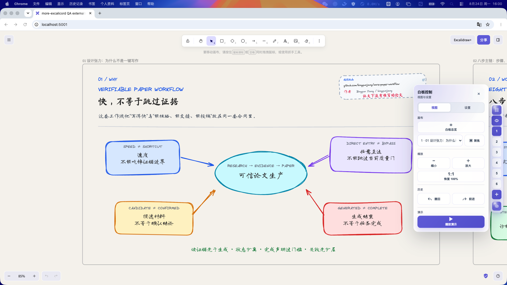
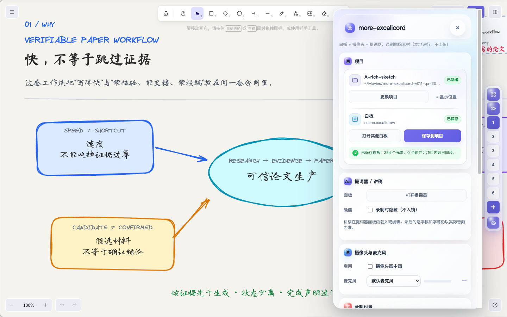
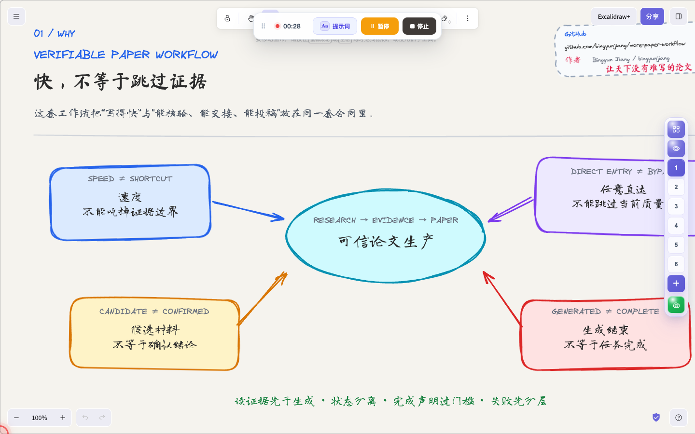

<p align="center">
  
</p>

<h3 align="center">落笔成画，开讲成片。</h3>

<p align="center">
  在 Excalidraw 中创作、讲解、录制，一气呵成。
</p>

<p align="center">
  <a href="#画中画让白板讲解更有人在场">画中画</a> ·
  <a href="#核心优势">核心优势</a> ·
  <a href="#功能全景">功能全景</a> ·
  <a href="#快速开始">快速开始</a> ·
  <a href="docs/user-guide.zh-CN.md">使用指南</a> ·
  <a href="CHANGELOG.md">更新日志</a> ·
  <a href="#more-系列从研究到表达">More 系列</a> ·
  <a href="LICENSE">MIT License</a>
</p>

> 当前版本：`v0.1.2` · 面向自托管 Excalidraw · 当前仅在 macOS 开发和验收

## 画中画，让白板讲解更有“人”在场

只录屏幕，观众能看到内容，却看不到讲解者。对于课程、技术汇报和产品演示，摄像头画中画能保留表情、视线和交流感，让白板讲解更自然，也更容易建立信任。

<p align="center">
  
</p>

`more-excalicord` 把画中画直接放进白板录制流程：

- 开启“摄像头画中画”即可在录制前预览人像；
- 支持左上、左下、右上、右下四角位置，以及形状、大小和镜像调整；
- 可以只作为录制时的屏幕气泡，也可以选择合成进最终视频；
- 白板全景、当前幻灯片和屏幕/窗口录制都能使用同一套讲解配置；
- 摄像头和麦克风仅在用户主动启用并授权后读取。

<p align="center">
  
</p>

上图是实际运行的录制面板：画中画、麦克风、提词器、画幅和录制范围都在同一个界面完成，不需要切换到其他录屏软件。

## 不止画中画，从白板到成片

`more-excalicord` 是面向自托管 Excalidraw 的轻量增强插件：默认设置即可开始录制并生成 MP4；需要时，还可以加入 Frame 幻灯片、提词器、字幕和录后编辑。

<p align="center">
  
</p>

适合用来制作技术方案讲解、课程与培训视频、论文与产品汇报，以及带桌面操作的软件教程。

## 核心优势

| 优势 | 对用户意味着什么 |
| --- | --- |
| 默认即可开始 | 载入白板、选择范围、点击录制；Frame、提词器和后期功能都不是前置条件 |
| 创作与讲解不分家 | 不必把白板搬进 PPT 或切换到另一套录屏软件，始终留在熟悉的 Excalidraw 中 |
| 白板与人同时在场 | 画中画、麦克风、提词器和屏幕补光集中设置，既保留内容，也保留讲解者的交流感 |
| 录制范围更准确 | 可录白板全景、当前幻灯片、整个屏幕或指定窗口，并在桌面录制前确认真实来源 |
| 原片始终安全 | 剪辑、字幕、镜头和画面包装采用非破坏式编辑，调整方案不会覆盖原始录制 |
| 项目完整带走 | 白板、原片、事件、逐字稿、字幕和成片集中在用户选择的本机项目目录中 |

## 功能全景

以下均为真实本地运行画面，不是产品设计稿。

### 1. 一张无限白板，也能像幻灯片一样讲

Frame 会成为可搜索、可重命名、可排序的讲解页。你既可以逐页聚焦演示，也能一键回到整张白板的鸟瞰视图；新增、删除和排序会与白板内容一起保存。

<p align="center">
  
</p>

白板控制还提供全景/聚焦切换、缩放、前进后退、网格和智能吸附，让讲解节奏与日常绘图操作保持一致。

<p align="center">
  
</p>

### 2. 一个项目目录，收好从白板到成片的全部内容

选择一次项目文件夹后，白板、录制会话、媒体、事件、文字资产和最终导出都有清晰归属。项目可以整体备份、迁移或继续编辑，不需要反复指定多个保存位置。

<p align="center">
  
</p>

### 3. 既能录白板，也能录屏幕和指定窗口

白板全景和当前幻灯片适合课程与方案讲解；屏幕或窗口录制适合软件演示。桌面录制前会显示来源类型和真实预览，确认后才开始，减少录错屏幕或窗口的风险。

<p align="center">
  
</p>

画幅支持常用横屏、竖屏和自定义尺寸；需要时还可隐藏桌面图标，并使用 2D 缩放、3D 运镜、鼠标点击和打字位置生成更自然的智能镜头。

### 4. 讲解辅助始终在手边

录制开始后，主面板会收起为轻量工具条，只保留计时、提词器、暂停和停止。工具条可拖动，也支持快捷键；提词器、麦克风状态、摄像头画中画、镜头增亮和屏幕补光都可以按需启用。

<p align="center">
  
</p>

### 5. 停止录制不是结束，原片也不会被覆盖

录后工作台把剪辑、逐字稿、智能粗剪、字幕、镜头、光标、摄像头、画面和音频集中到同一时间线。所有调整都保存为编辑方案，随时可以撤销、恢复或重新导出。

<p align="center">
  
</p>

逐字稿来自实际录音；提词稿只辅助讲解，不会冒充录音内容。智能粗剪只提出建议，接受后才会写入剪辑轨；包含点击、指针或幻灯片切换的静音段会保留复核提示。

### 6. 字幕、画面包装与 MP4 一次交付

校对后的逐字稿可以生成并编辑字幕，导出时可加入智能镜头、动态光标、摄像头、背景、圆角、留白、阴影和音频淡入淡出，最终写入 `exports/final.mp4`。

<p align="center">
  
</p>

## 默认设置，直接开录

1. 载入或新建一张 Excalidraw 白板。
2. 选择“白板全景”或“当前幻灯片”；希望出镜时，开启“摄像头画中画”和“摄像头合成进视频”。
3. 停止后直接得到原始 MP4；需要精修时，再进入录后编辑并导出 `exports/final.mp4`。

<p align="center">
  
</p>

画中画只需按需开启；Frame 整理、桌面窗口、提词器、字幕和智能剪辑也都不是开始录制的前置条件。

## 快速开始

### macOS（当前支持）

当前安装脚本和原生 Capture Agent 仅按 macOS 开发、测试和发布。准备好 Node.js、npm 和一个可运行的自托管 Excalidraw，然后执行：

```bash
git clone https://github.com/bingyunjiang/more-excalicord.git
cd more-excalicord
npm run setup:local
npm run check
npm run deploy:local
```

部署后打开 `http://localhost:5001/`。右侧出现 more-excalicord 工具栏，即可载入[示例白板](examples/more-paper-workflow-video-rich-sketch-20260815.excalidraw)体验。

自定义 Excalidraw 目录、macOS Capture Agent、本地 ASR 和权限配置见[完整安装说明](docs/install.zh-CN.md)。

### Windows（尚未适配）

当前版本**没有可直接安装的 Windows Capture Agent，也未在 Windows 上完成端到端验收**。请勿把 macOS 的 Bash、Swift、LaunchAgent 或权限步骤直接照搬到 Windows。网页插件中的一部分通用能力可能可以运行，但屏幕/窗口录制、项目目录原生访问、MP4 编码、后台启动和完整录后导出不能视为已支持。

本项目暂不安排官方 Windows 实现；希望自行适配的用户可从 [Windows 适配开发计划](docs/windows-porting-plan.zh-CN.md) 开始。该文档给出了推荐目录、现有本地协议、分阶段任务、Windows 技术映射、安全要求和验收矩阵。适配完成前，Windows 用户应自行构建、测试和维护分支。

## 文档与开发

| 我想…… | 从这里开始 |
| --- | --- |
| 尽快用起来 | [快速开始](docs/quickstart.zh-CN.md) · [使用指南](docs/user-guide.zh-CN.md) |
| 完成安装或排障 | [安装说明](docs/install.zh-CN.md) · [排障说明](docs/troubleshooting.zh-CN.md) |
| 了解项目文件 | [项目格式](docs/project-format.zh-CN.md) |
| 参与开发或发布 | [开发指南](docs/developer-guide.zh-CN.md) · [Windows 适配计划](docs/windows-porting-plan.zh-CN.md) · [发布检查](docs/release-checklist.zh-CN.md) |
| 查看历史实测证据 | [v0.1.1 UX 复核](docs/v0.1.1-ux-review.zh-CN.md) |
| 查看版本变化 | [更新日志](CHANGELOG.md) |

## More 系列：从研究到表达

`more-*` 是 Dr. Jiang 发起的一组开源创作与研究工具，强调本地优先、过程透明、来源可追溯和结果可复核。你可以从当前任务直接选择合适的项目，也可以把各自已经验收的成果组合进自己的工作流。

| 项目 | 帮你完成什么 |
| --- | --- |
| [more-news-briefing](https://github.com/bingyunjiang/more-news-briefing) | 收集、去重并核验新闻与行业信息，生成可追溯的专题简报 |
| [more-paper-workflow](https://github.com/bingyunjiang/more-paper-workflow) | 从研究问题、文献检索和证据组织，到论文写作与引用审计 |
| [more-sci-figure](https://github.com/bingyunjiang/more-sci-figure) | 提取科研图表数据、聚焦异常复核，并交付论文级可编辑图件 |
| [more-chat-excalidraw](https://github.com/bingyunjiang/more-chat-excalidraw) | 用自然语言生成结构化、可继续编辑的 Excalidraw 白板 |
| **[more-excalicord](https://github.com/bingyunjiang/more-excalicord)**（当前项目） | 把 Excalidraw 白板变成带画中画、讲解和录后编辑的视频 |

这些项目彼此独立安装、独立运行、独立验收，不会自动调用其他项目或共享你的项目数据。[查看 Dr. Jiang 的全部公开项目](https://github.com/bingyunjiang?tab=repositories&q=more-)。

## 作者与许可

作者：Dr. Jiang（Bingyun Jiang）<br>
微信：Bingyunjiang · 邮箱：bingyunjiang@qq.com · GitHub：[@bingyunjiang](https://github.com/bingyunjiang)

本项目采用 [MIT License](LICENSE)。
