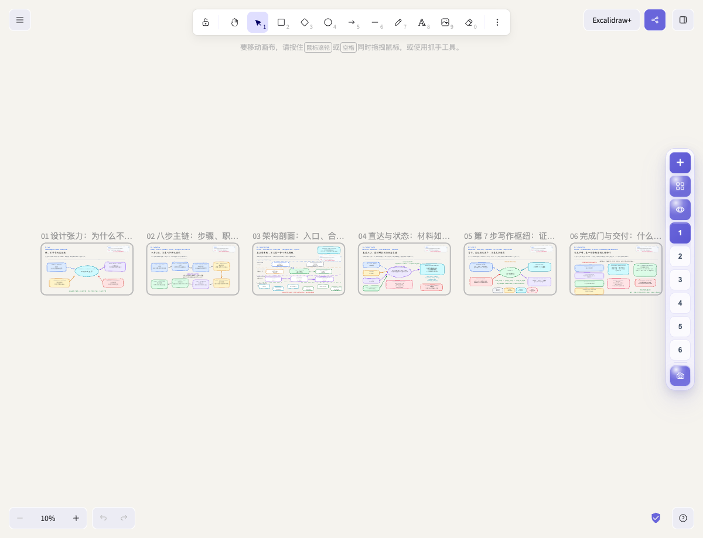
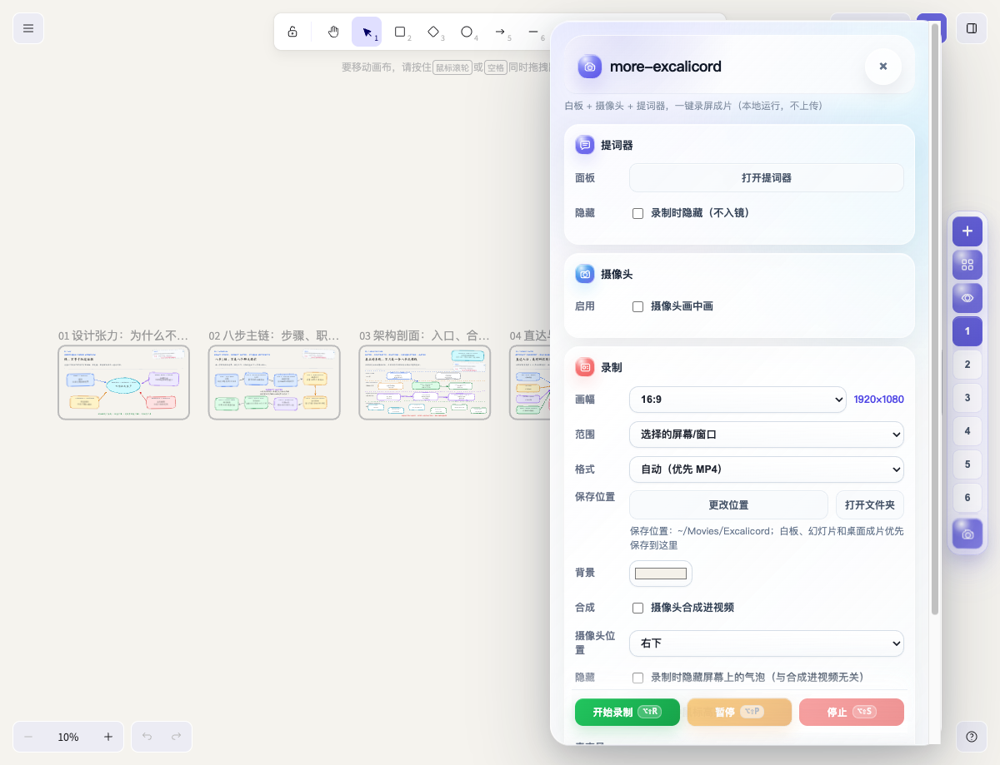
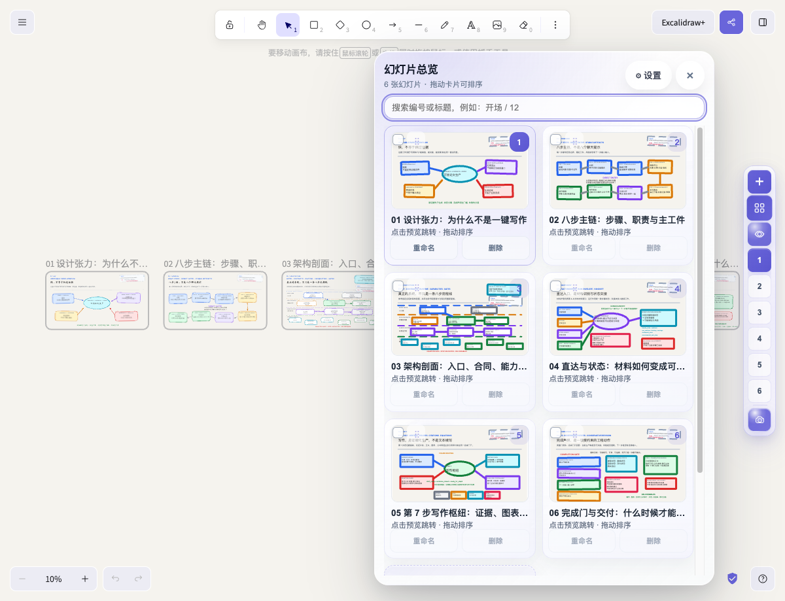
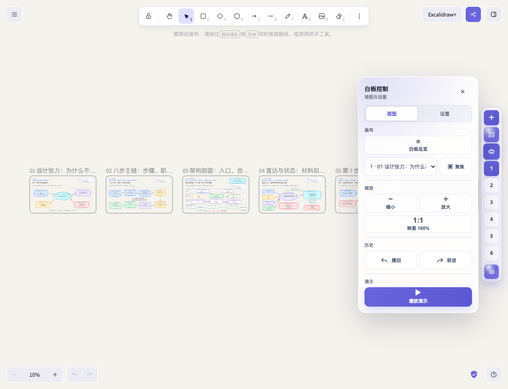
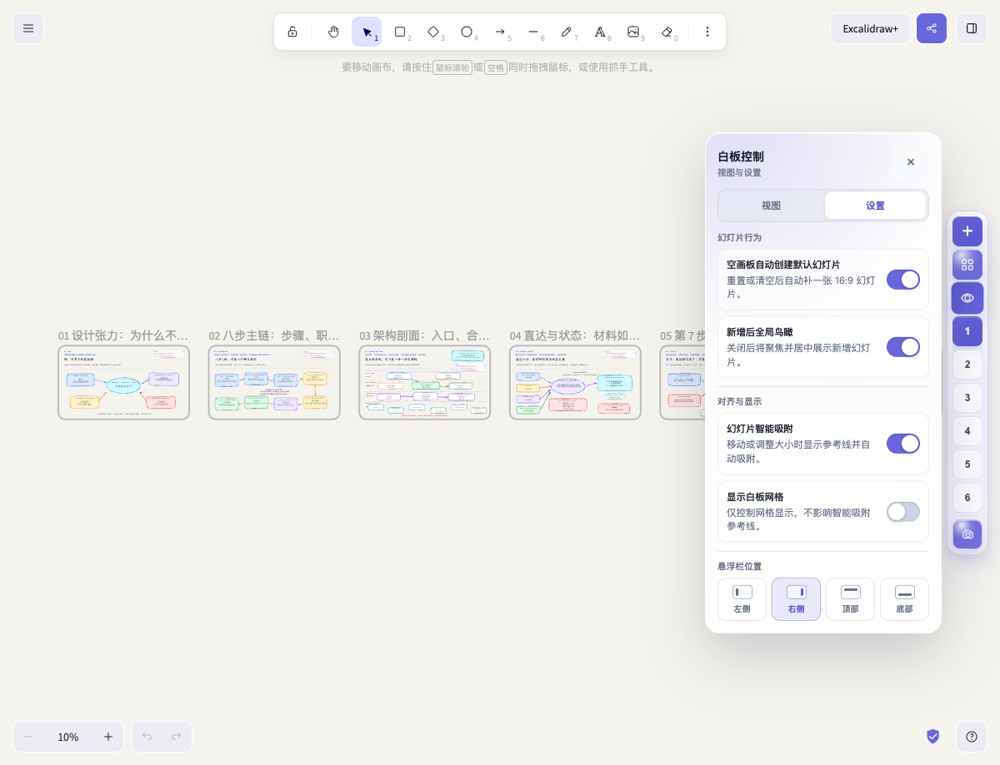
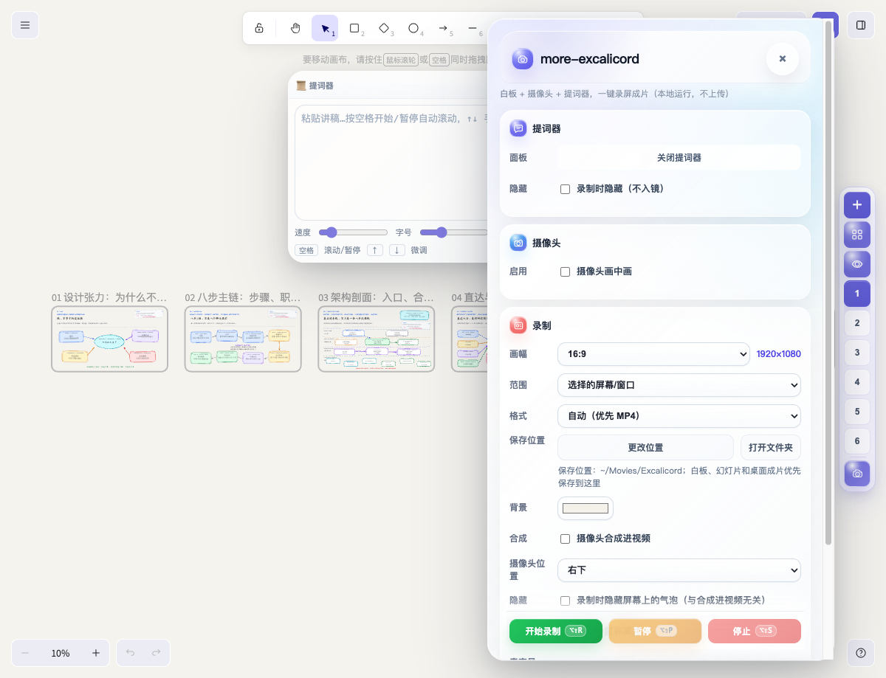
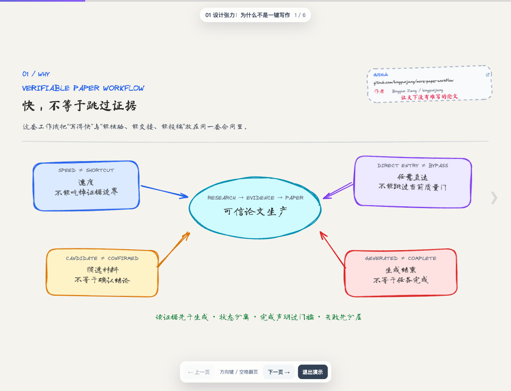

   
  <strong>more-excalicord</strong> 
  <em>给 Excalidraw 加上画中画录屏、提词器、幻灯片</em>

  <a href="package.json">v0.1.0</a> ·
  <a href="LICENSE">MIT License</a> ·
  <a href="docs/quickstart.zh-CN.md">快速开始</a> ·
  <a href="docs/user-guide.zh-CN.md">使用说明</a>

<blockquote>
  <strong>作者 / Author：</strong> Dr. Jiang（Bingyun Jiang） 
  微信：Bingyunjiang　·　邮箱：bingyunjiang@qq.com　·　GitHub：<a href="https://github.com/bingyunjiang">bingyunjiang</a>
</blockquote>

## 它是什么

<code>more-excalicord</code> 是一个面向自托管 Excalidraw 的本地增强插件。它把同一张白板里的 Frame 组织成“幻灯片”，并把录屏常用能力放进白板内：屏幕/窗口录制、白板画布录制、当前幻灯片录制、摄像头画中画、摄像头合成进视频、提词器、演示播放和本地场景保存。

它适合把一张自由白板变成可讲解、可投屏、可录制、可交付的演示资产：白板仍然是 Excalidraw 白板，内容仍可继续编辑；讲解时可以选择录整个屏幕、只录白板画布，或只录当前 Frame，并按需要把摄像头画中画显示在屏幕上或写入最终视频。

    Excalidraw 白板
      → Frame 作为幻灯片
      → 选择录制范围：屏幕/窗口 · 白板画布 · 当前幻灯片
      → 摄像头画中画 / 合成进视频 / 提词器
      → 本地成片与可继续编辑的白板资产

## 真实插件截图

下面截图来自部署后的 <code>http://localhost:5001/</code> 页面。演示白板使用 [examples/more-paper-workflow-video-rich-sketch-20260815.excalidraw](examples/more-paper-workflow-video-rich-sketch-20260815.excalidraw)，包含 284 个元素、6 个 Frame，用来展示多页白板在 more-excalicord 中的真实操作状态。

  

右侧紫色工具栏是 more-excalicord 的统一入口：<code>＋</code> 新增幻灯片，网格按钮打开总览，眼睛按钮打开白板控制，数字按钮切换幻灯片，底部摄像机按钮打开录制面板。

## 录屏核心能力

  

more-excalicord 的录屏不是一个简单“开始/停止”按钮，而是一组围绕白板讲解的录制选项。

| 能力 | 说明 | 适合场景 |
| --- | --- | --- |
| 屏幕/窗口录制 | 录制选中的屏幕或应用窗口 | 讲解时需要切到浏览器、PPT、Zotero 或其他应用 |
| 白板画布录制 | 只录 Excalidraw 白板区域 | 录课程、论文流程、技术白板，不想录入浏览器外部界面 |
| 当前幻灯片录制 | 围绕当前 Frame 录制，并支持连续切换讲解 | 把白板当成分镜或幻灯片逐页录 |
| 摄像头画中画 | 在白板上显示人像气泡 | 讲课、汇报、录制口播视频 |
| 摄像头合成进视频 | 把人像画中画写进导出视频 | 成片离开浏览器后仍保留讲解人像 |
| 提词器 | 粘贴讲稿、调速度、调字号、可选择录制时隐藏 | 需要稳定口播节奏的演示录制 |

画中画有两个层次：屏幕上的摄像头气泡用于讲解时预览；“摄像头合成进视频”用于把人像真正写入导出的 MP4/WebM。二者分开控制，避免只在屏幕上看到人像、导出后却没有人像。

## 为什么值得用

| 你遇到的问题 | more-excalicord 的回答 |
| --- | --- |
| 想录完整桌面、只录白板或只录当前页 | 三种录制范围：屏幕/窗口、白板画布、当前幻灯片 |
| 想边讲边露脸，导出后也保留人像 | 摄像头画中画可预览，也可合成进最终视频 |
| Excalidraw 白板很适合思考，但演示时容易迷路 | 用 Frame 作为幻灯片，提供切换、总览、聚焦和播放 |
| 录制讲解要在多个工具之间切换 | 在同一白板里打开录制、摄像头、提词器和成片保存 |
| 新增、删除、重排 Frame 后状态容易丢 | 把调整后的白板状态保存到本地场景文件 |
| 大量 Frame 堆在一起不好管理 | 幻灯片总览支持真实预览、搜索、重命名、多选、删除和拖拽排序 |
| 录屏验收只看按钮状态不可靠 | 以真实下载视频和本地播放器回放作为最终确认 |
| 不想把白板内容上传到第三方 | 白板、录制和保存流程按本地优先设计 |

## 功能总览

### 1. 幻灯片导航：Frame 变成可切换的页

  

more-excalicord 读取当前 Excalidraw 场景中的 Frame，并把它们按画布坐标组织成幻灯片序列。导航栏不会把白板拆成多个文件，而是在同一张白板上提供类似 PPT 的页切换体验。

- 数字按钮直接跳转到对应幻灯片；
- 当前页高亮，适合边讲边切；
- Frame 数量很多时自动收敛为紧凑导航，避免无限竖排；
- 底部录制入口、Frame 导航、总览和白板控制保持在同一个工具栏里。

### 2. 幻灯片总览：真实内容预览、搜索、排序和批量管理

  

总览面板显示的不是占位图，而是每个 Frame 的真实内容缩略图。它适合在录屏或汇报前快速检查页序、标题和内容完整性。

- 搜索编号或标题，例如“开场 / 12”；
- 点击卡片预览直接跳转；
- 拖动卡片调整页序；
- 支持重命名、删除和多选批量删除；
- 设置入口与总览同位，方便管理大量幻灯片。

### 3. 白板控制：总览、聚焦、缩放、撤回、前进和播放

  

白板控制把演示时常用的视图动作放在一个轻量面板里，不必再去 Excalidraw 原生菜单里寻找。

| 能力 | 用途 |
| --- | --- |
| 白板总览 | 一键回到所有 Frame 的鸟瞰状态 |
| 聚焦 | 从下拉框选择某一张幻灯片并居中查看 |
| 缩放 | 放大、缩小、恢复 100% |
| 历史 | 撤回、前进 |
| 播放演示 | 进入简洁的全屏式演示控制层 |

### 4. 幻灯片设置：默认页、鸟瞰、吸附、网格和工具栏位置

  

设置页用于控制幻灯片行为和界面位置，默认尽量让用户少操心。

- 空画板可自动创建一张 16:9 默认幻灯片；
- 新增幻灯片后默认进入全局鸟瞰，方便看整体布局；
- 移动或调整幻灯片大小时支持智能吸附和参考线；
- 白板网格可独立显示或隐藏；
- 工具栏可放在左侧、右侧、顶部或底部。

### 5. 录屏范围与画中画：屏幕/窗口、白板、当前幻灯片

  

录制面板把讲解录制需要的配置集中在一起。你可以先选画幅，再选录制范围，最后决定是否开启摄像头画中画、是否把摄像头合成进成片。截图中的状态显示保存位置为 <code>~/Movies/Excalicord</code>，画幅为 16:9，输出尺寸为 1920×1080。

#### 三种录制范围

| 范围 | 录什么 | 典型用途 |
| --- | --- | --- |
| 选择的屏幕/窗口 | 录制用户选择的整个屏幕或应用窗口 | 讲解资料时需要在 Excalidraw、浏览器、PPT、文献管理器之间切换 |
| 仅白板画布 | 录制 Excalidraw 白板内容 | 只交付干净的白板讲解，不录入浏览器地址栏、系统桌面或其他窗口 |
| 当前幻灯片 | 录制当前 Frame 对应的幻灯片视图 | 按分镜逐页讲解，适合课程、论文流程、产品演示和短视频脚本 |

#### 摄像头画中画

| 选项 | 作用 |
| --- | --- |
| 摄像头画中画 | 在白板上显示可见的人像气泡，便于讲解时看自己的出镜状态 |
| 摄像头合成进视频 | 把人像写入导出的成片中，成片离开浏览器后仍保留画中画 |
| 摄像头位置 | 选择合成位置：左上、右上、左下、右下 |
| 录制时隐藏屏幕气泡 | 只控制屏幕上是否显示气泡，不等同于关闭视频合成 |

| 设置 | 说明 |
| --- | --- |
| 画幅 | 16:9、4:3、1:1、9:16、3:4 |
| 范围 | 选择的屏幕/窗口、仅白板画布、当前幻灯片 |
| 格式 | 自动优先 MP4，也可指定 MP4 或 WebM |
| 保存位置 | 支持更改位置和打开文件夹 |
| 摄像头合成 | 可把摄像头画中画合成进导出视频 |
| 摄像头位置 | 左上、右上、左下、右下 |
| 光标 | 录制中鼠标高亮 |
| 快捷键 | 开始、暂停、停止均有快捷键提示 |

录制功能的最终验收不以按钮状态为准，而以真实录制、下载或保存成片，并用本地播放器回放为准。尤其是画中画和当前幻灯片录制，应检查导出视频里是否真的保留人像、画面范围和切页效果。

### 6. 提词器：讲稿、速度、字号和透明度

  

提词器适合课程录制、论文流程讲解和技术汇报。它可以独立打开，也可以在录制时选择隐藏，避免进入画面。

- 粘贴讲稿后自动滚动；
- 空格开始或暂停；
- 上下方向键微调；
- 可调速度、字号和透明度；
- 录制时可选择隐藏提词器。

### 7. 演示模式：白板里的播放控制层

  

演示模式会隐藏日常编辑辅助，只保留当前页、页码、上一页、下一页和退出演示等必要控件。它适合投屏、讲课和录制当前白板内容。

## 示例白板资产

当前仓库带有一个脱敏示例白板，用于复现上面的截图和功能说明。

| 资产 | 用途 |
| --- | --- |
| [more-paper-workflow-video-rich-sketch-20260815.excalidraw](examples/more-paper-workflow-video-rich-sketch-20260815.excalidraw) | 在 Excalidraw 中继续编辑的源白板 |
| [more-paper-workflow-video-rich-sketch-20260815.svg](examples/more-paper-workflow-video-rich-sketch-20260815.svg) | 网页预览和矢量展示 |
| [more-paper-workflow-video-rich-sketch-20260815.pdf](examples/more-paper-workflow-video-rich-sketch-20260815.pdf) | 汇报、归档或离线查看 |
| [README 截图目录](docs/assets/readme/) | 本 README 使用的真实插件操作截图 |

这些示例资产可公开展示。个人白板、未脱敏项目材料和录屏成片建议只保存在自己的工作目录中。

## 部署前置条件

more-excalicord 是本地 Excalidraw 的增强插件。部署前建议先准备好下面几项：

| 前置条件 | 作用 | 如何提前检查或配置 |
| --- | --- | --- |
| Node.js 18+ 与 npm | 运行检查、预检和部署脚本 | <code>node -v</code>、<code>npm -v</code>，缺失时先安装 Node.js |
| Git 或 ZIP 下载能力 | 获取本仓库源码 | 推荐 <code>git clone</code>；不会用 Git 时可下载 ZIP |
| 自托管 Excalidraw 运行目录 | more-excalicord 会把脚本、样式和本地服务复制进去 | 默认 <code>~/.local/share/excalidraw</code>；其他位置用 <code>npm run configure:local -- --runtime-root /path/to/excalidraw</code> |
| 可访问的本地 Excalidraw 页面 | 浏览器验收插件是否生效 | 部署后打开 <code>http://localhost:5001/</code> |
| 浏览器录制权限 | 使用屏幕/窗口录制、摄像头、麦克风 | 首次录制时按浏览器或系统提示允许屏幕录制、摄像头和麦克风 |
| 可选：Codex、Claude Code、Cursor 等本地大模型助手 | 让大模型帮你检查路径、执行命令、解释报错 | 给它本仓库目录和下面的部署提示词，让它先运行预检再部署 |

推荐先执行一次预检；它会提前检查命令、Node 版本、运行目录、写入权限和本地页面状态：

    npm run preflight

## 3 分钟开始

### 1. 下载源码

    git clone https://github.com/bingyunjiang/more-excalicord.git
    cd more-excalicord

### 2. 配置本地 Excalidraw 运行目录

如果你的 Excalidraw 运行目录就是默认位置，可以直接运行：

    npm run setup:local

如果你的运行目录不同，先写入本地配置文件 <code>.env.local</code>：

    npm run configure:local -- --runtime-root /path/to/excalidraw
    npm run preflight

<code>.env.local</code> 会被 Git 忽略，不会上传到仓库。

### 3. 检查仓库

    npm run check

看到 <code>check ok</code> 表示源码语法、关键文件、CSS 括号和提交边界检查通过。

### 4. 部署插件

    npm run deploy:local

部署脚本会先运行预检，再把插件脚本、样式和本地服务文件复制到 Excalidraw 应用目录，并做一次一致性检查。

### 5. 打开白板验收

在浏览器打开：

    http://localhost:5001/

页面出现 more-excalicord 悬浮栏后，至少检查一次：新增幻灯片、打开幻灯片总览、打开白板控制、打开录制面板。录制相关改动建议分别试录屏幕/窗口、白板画布和当前幻灯片三种范围；如果开启摄像头，还要确认画中画是否显示、是否按预期合成进成片。

## 用 Codex 等大模型辅助部署

如果你使用 Codex、Claude Code、Cursor、ChatGPT Desktop 这类能读写本地文件并执行终端命令的大模型助手，可以把下面这段提示词交给它。这样用户不需要先理解每个脚本的细节，大模型会先检查前置条件，再配置和部署。

~~~text
请帮我在本机部署 more-excalicord。仓库目录是当前目录。
要求：
1. 先运行 npm run preflight，检查 Node.js/npm、本地 Excalidraw 运行目录、写入权限和 http://localhost:5001/ 状态。
2. 如果运行目录不是 ~/.local/share/excalidraw，先问我真实路径，然后运行 npm run configure:local -- --runtime-root <真实路径>。
3. 运行 npm run check，再运行 npm run deploy:local，最后运行 npm run verify:deploy。
4. 部署后提示我打开 http://localhost:5001/，检查右侧 more-excalicord 工具栏、录制面板、三种录制范围、摄像头画中画和摄像头合成进视频。
5. 不要提交个人白板、录屏、密钥、.env.local 或本机缓存文件。
6. 如果缺少 Node.js、自托管 Excalidraw 或浏览器录制权限，先说明缺什么，再给出安装或配置步骤；不要跳过预检直接部署。
~~~

大模型适合处理路径判断、终端报错和重复验证；但摄像头授权、屏幕录制授权、真实 MP4/WebM 回放仍需要用户在本机确认。

## 开发与维护

建议始终在本仓库中修改源码，然后部署到本地 Excalidraw 服务中验收。

    修改源码
      → npm run check
      → npm run deploy:local
      → 打开 http://localhost:5001/ 目检和实录验收
      → git commit
      → git push

如果你为了紧急调试直接改了已部署文件，调试完成后请先同步回仓库，再检查和提交：

    npm run sync:from-live
    npm run check
    npm run verify:deploy

## 常用命令

| 命令 | 用途 |
| --- | --- |
| <code>npm run preflight</code> | 部署前检查 Node.js、npm、本地 Excalidraw 目录、写入权限和本地页面状态 |
| <code>npm run configure:local -- --runtime-root /path/to/excalidraw</code> | 写入本机部署目录配置，不上传到 Git |
| <code>npm run setup:local</code> | 使用默认运行目录写入配置并执行预检 |
| <code>npm run check</code> | 检查 JS 语法、CSS 括号、关键文件和不应提交的场景文件 |
| <code>npm run deploy:local</code> | 把插件源码部署到本地 Excalidraw 服务 |
| <code>npm run verify:deploy</code> | 比较仓库源码与已部署文件是否一致 |
| <code>npm run sync:from-live</code> | 从已部署文件同步当前版本回仓库 |
| <code>npm run status</code> | 查看 Git 状态、分支、远端和部署一致性 |
| <code>npm run pack:release</code> | 生成可用于 Release 的 zip 包 |

## 验收清单

### 基础功能

- 页面能打开，悬浮栏能显示；
- 示例或真实白板能被识别为多张幻灯片；
- 新增幻灯片后能看到合理布局，默认进入全局鸟瞰；
- 幻灯片总览能打开，预览、搜索、重命名、删除和排序符合预期；
- 白板控制能执行总览、聚焦、缩放、撤回、前进和播放演示；
- 设置项能保存并反映到当前交互。

### 录制功能

- 屏幕/窗口录制可用；
- 白板录制可用；
- 当前幻灯片录制可用；
- 摄像头画中画在屏幕上可见；
- 开启“摄像头合成进视频”后，导出视频中确实保留人像；
- 摄像头位置左上、右上、左下、右下符合预期；
- 下载的视频能用本地播放器正常播放；
- 折叠录制面板不会中断正在进行的录制、摄像头或提词器。

自动检查只能证明代码和部署链路没有明显断裂，不能替代真实白板、真实浏览器和真实成片回放。

## 项目结构

| 路径 | 内容 |
| --- | --- |
| <code>src/studio-recorder.js</code> | 主插件逻辑 |
| <code>src/recorder.css</code> | 插件界面样式 |
| <code>src/native-bridge.js</code> | 本地桥接脚本 |
| <code>src/vendor/</code> | 摄像头美颜相关的本地前端依赖 |
| <code>server/no-cache-server.js</code> | 本地服务脚本，用于无缓存刷新和场景保存 |
| <code>scripts/</code> | 检查、部署、同步、状态和发布打包脚本 |
| <code>assets/brand/</code> | logo、图标、favicon 和分享封面等品牌资源 |
| <code>docs/</code> | 用户和维护文档 |
| <code>examples/</code> | 可公开展示的示例白板 |

## 隐私与安全

- 白板内容和录制文件默认保存在本地；
- 示例目录只放已脱敏、可公开展示的白板；
- 不建议提交个人白板、录屏成片、浏览器缓存、备份目录或私有配置；
- 不要把密钥、账号、token 或 <code>.env</code> 文件放进仓库。

## 文档入口

| 文档 | 用途 |
| --- | --- |
| [快速开始](docs/quickstart.zh-CN.md) | 第一次下载、检查、部署和打开 |
| [安装与部署](docs/install.zh-CN.md) | 本地路径、仓库结构和部署验收点 |
| [使用说明](docs/user-guide.zh-CN.md) | 悬浮栏、幻灯片、白板控制和录制 |
| [常见问题](docs/troubleshooting.zh-CN.md) | 页面不生效、部署不一致和录制问题 |
| [开发与同步](docs/developer-guide.zh-CN.md) | 源码仓库、部署目录和 Git 工作流 |
| [发布检查清单](docs/release-checklist.zh-CN.md) | 发布前检查、打包和发布后复验 |
| [版本历史](CHANGELOG.md) | 版本发布记录和主要变更 |
| [品牌资源](assets/brand/) | logo、图标、favicon 和分享封面 |
| [本地文件映射](references/local-runtime.md) | 源码文件部署到 Excalidraw 应用目录的对应关系 |

## More 系列

<code>more-*</code> 是一组强调过程透明、来源可追溯和结果可复核的本地优先工作流项目。每个项目独立安装、独立运行、独立验收；下面的索引用于选对工具，不表示它们会自动互相调用或共享项目状态。

| 项目 | 主要用途 |
| --- | --- |
| **more-excalicord**（当前项目） | 本地 Excalidraw 幻灯片、演示、录制、摄像头、提词器和白板控制 |
| [more-chat-excalidraw](https://github.com/bingyunjiang/more-chat-excalidraw) | 把自然语言变成可编辑、可验证、可交付的 Excalidraw 图表 |
| [more-paper-workflow](https://github.com/bingyunjiang/more-paper-workflow) | 论文定题、文献检索、证据组织、写作、科研图表和引用审计 |
| [more-sci-figure](https://github.com/bingyunjiang/more-sci-figure) | 科研图表数据提取、人工复核、论文级重绘与交付验证 |
| [more-news-briefing](https://github.com/bingyunjiang/more-news-briefing) | 新闻与行业信息收集、去重、排序、核验和简报生成 |
| [more-comic-digitizer](https://github.com/bingyunjiang/more-comic-digitizer) | 儿童手绘漫画数字化、审核、共创与电子出版 |
| [more-excalidraw-feishu](https://github.com/bingyunjiang/more-excalidraw-feishu) | Excalidraw 到飞书白板的本地转换和写回 |
| [more-feishu-excalidraw](https://github.com/bingyunjiang/more-feishu-excalidraw) | 飞书文档到 Excalidraw 白板的结构化转换 |

## 版本历史

| 版本 | 日期 | 定义 | 说明 |
| --- | --- | --- | --- |
| [v0.1.0](CHANGELOG.md#v010---2026-08-21) | 2026-08-21 | 初版发布版本 | 首次公开发布，包含 Frame 幻灯片、白板控制、录屏范围、摄像头画中画、摄像头合成进视频、提词器、部署预检和示例截图 |

完整记录见 [CHANGELOG.md](CHANGELOG.md)。

## 版本与许可

- 当前版本：<code>v0.1.0</code>，初版发布版本，见 [package.json](package.json) 和 [CHANGELOG.md](CHANGELOG.md)；
- 许可证：[MIT License](LICENSE)；
- 当前主要面向自托管 Excalidraw 和本地录制场景。
