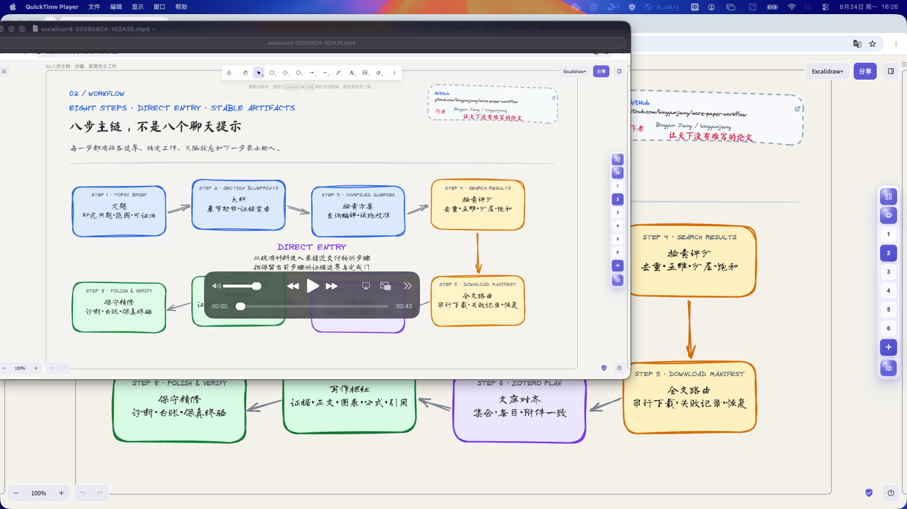
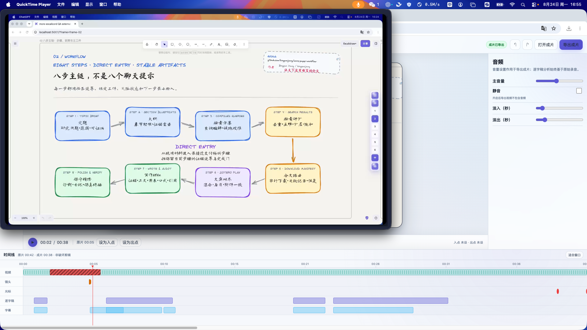

<p align="center">
  <br>
  <strong>more-excalicord</strong><br>
  <em>把 Excalidraw 白板变成可录制、可剪辑、可交付的本地讲解视频项目</em>
</p>

<p align="center">
  <a href="package.json">v0.1.1</a> ·
  <a href="docs/quickstart.zh-CN.md">快速开始</a> ·
  <a href="docs/user-guide.zh-CN.md">使用说明</a> ·
  <a href="LICENSE">MIT License</a>
</p>

> **作者 / Author：** Dr. Jiang（Bingyun Jiang）<br>
> 微信：Bingyunjiang · 邮箱：bingyunjiang@qq.com · GitHub：[bingyunjiang](https://github.com/bingyunjiang)

## 一句话说明

`more-excalicord` 是面向自托管 Excalidraw 的本地录制与后期扩展：用 Frame 组织讲解页，在同一界面完成白板演示、屏幕/白板/当前页录制、提词、摄像头画中画、非破坏剪辑、逐字稿、字幕、镜头与光标效果，最后导出 MP4。

    一张 Excalidraw 白板
      → Frame 幻灯片与演示控制
      → 屏幕 / 白板全景 / 当前幻灯片录制
      → 提词器 + 麦克风 + 摄像头画中画
      → 原始录制 + Frame / 点击 / 指针事件
      → 剪辑 + 逐字稿 + 字幕 + 镜头与画面效果
      → exports/final.mp4

它主要解决两件事：让大白板在讲解时不迷路；让录制、素材、编辑决策和成片留在同一个本地项目里。

## 核心功能

| 功能域 | 能力 | 使用价值 |
| --- | --- | --- |
| Frame 幻灯片 | 页码导航、真实缩略图总览、搜索、重命名、拖拽排序、批量删除、新增 Frame | 一张自由白板也能按页讲解和维护 |
| 白板演示 | 鸟瞰、指定页聚焦、缩放、撤回/前进、播放模式、四向工具栏 | 讲解时快速定位，不打断叙事 |
| 三种录制范围 | 选择屏幕/窗口、白板全景、当前幻灯片聚焦 | 覆盖桌面操作、纯白板课程和逐页汇报 |
| 讲解辅助 | 提词器、麦克风电平、摄像头气泡、四角位置、形状/大小/镜像、屏幕环形补光 | 录制时保持节奏并预览人像布局 |
| 录制效果 | 智能镜头、Frame/鼠标/点击/输入事件、光标高亮/圆环/十字线/点击反馈 | 为后期镜头和操作提示保留事件依据 |
| 本地项目 | `scene.excalidraw`、附件、原片、事件、逐字稿、字幕、编辑时间线、成片同目录保存 | 项目可追踪，原始素材不被覆盖 |
| 录后编辑 | 非破坏剪辑、撤销/重做、ASR 或逐字稿导入、校对、字幕、智能粗剪 | 从原片到可交付成片无需换项目 |
| 成片效果 | 镜头关键帧、光标、摄像头、人像层、背景、圆角、留白、音量与淡入淡出 | 在导出前统一完成视频包装 |
| 本地优先 | 浏览器直存 + macOS Capture Agent；严格限制可写项目路径 | 白板和录制不必上传第三方服务 |

## 真实案例：扩展屏完整实测

以下截图和数据均来自 **2026-08-24 的实际运行**，不是设计稿。测试页面为 `http://localhost:5001/`，Chrome 窗口和所有功能操作均放在 **HP 24y 扩展屏（1920×1080）**；案例使用：

[`examples/more-paper-workflow-video-rich-sketch-20260815.excalidraw`](examples/more-paper-workflow-video-rich-sketch-20260815.excalidraw)

案例加载后识别到 **6 个 Frame、284 个元素**。测试使用隔离项目目录，不改写源案例和用户原有项目。

### 1. 白板、幻灯片与提词

<p align="center">
  
</p>

总览实际完成了搜索、跳转、重命名、拖拽排序、多选删除和新增 Frame；破坏性操作完成后重新载入源案例，最终恢复为 6 个 Frame、284 个元素。

<p align="center">
  
</p>

鸟瞰、指定页聚焦、缩放、播放演示和工具栏四向停靠均做了实际切换；自动默认页、新增后鸟瞰、智能吸附和网格开关也完成了关闭、开启与恢复。

<p align="center">
  
</p>

提词器实际验证了讲稿输入、速度、字号、透明度、自动滚动、录制时隐藏以及项目重载后的讲稿恢复。

### 2. 扩展屏来源选择与真实录制

<p align="center">
  
</p>

Native Capture Agent 能列出真实显示器预览；本轮选择 `显示器 3 · 1920×1080`，并在扩展屏上完成开始、暂停、继续和停止。

<p align="center">
  
</p>

三条录制链路均生成并用 `ffprobe` 检查实际媒体文件：

| 录制范围 | 实际输出 | 音轨 | 实际验证 |
| --- | --- | --- | --- |
| 白板全景 | H.264，1920×1080，30 fps，19.20 秒 | AAC | 摄像头画中画实际合成、录制工具条拖动、暂停/继续/停止 |
| 当前幻灯片 | H.264，1080×1920，3.13 秒 | **本轮未生成音轨** | 竖屏画幅和 Frame 聚焦生效 |
| 扩展屏桌面 | H.264，1920×1080，42.20 秒 | AAC | 真实选择 HP 24y、桌面图标隐藏/恢复、补光开关、QuickTime 回放 |

摄像头实际取得 1280×720 本地视频，并验证了圆形/圆角/胶囊形、大小、镜像、四角位置和写入视频。为避免在公开仓库保存真实人像，本 README 只保留下方隐私安全的占位示意图。

<p align="center">
  
</p>

### 3. 录后编辑与最终成片

<p align="center">
  
</p>

实际打开 42.20 秒原片并验证了 9 个编辑模块：剪辑、逐字稿、智能粗剪、字幕、镜头、光标、摄像头、画面和音频。测试包括：

- 设置剪辑区间并撤销/重做；
- 对真实音轨运行本地 ASR；因测试录制没有口播，正确返回“未检测到带词级时间戳的语音”；
- 导入 6 段、29 词的词级逐字稿，校对后持久化原稿、修订记录和校正版；
- 生成、编辑、增删字幕并导出 SRT/VTT；
- 生成 7 条粗剪建议，其中 4 条可直接处理、3 条需人工复核；含点击事件的静音区间被明确提示不可只凭静音删除；
- 配置镜头关键帧、光标提示、摄像头位置、背景、圆角、留白、音量和淡入淡出；
- 实际渲染出 38.40 秒 H.264/AAC 成片，并在 QuickTime 中回放。

<p align="center">
  
</p>

上图直接抽取自本轮 `exports/final.mp4`，可见字幕已经写入画面。

<p align="center">
  
</p>

## 本轮全功能测试结论

| 测试域 | 结果 | 证据或说明 |
| --- | --- | --- |
| 案例载入与恢复 | 通过 | 6 Frame、284 元素；破坏性测试后恢复源案例 |
| Frame 导航 | 通过 | 页码切换、当前页状态、全局鸟瞰 |
| 幻灯片总览 | 通过 | 真实缩略图、搜索、重命名、排序、新增、多选删除 |
| 白板控制与设置 | 通过 | 聚焦、缩放、播放、四向停靠、鸟瞰/吸附/网格设置 |
| 项目保存与重载 | 通过 | `scene.excalidraw`、schema v2 manifest、讲稿及 3 条录制均可重载 |
| 提词器 | 通过 | 文本、速度、字号、透明度、自动滚动、隐藏与持久化 |
| 摄像头与麦克风 | 通过 | 真实相机 1280×720、麦克风许可/电平、形状/位置/镜像/合成 |
| 录制效果 | 通过 | 智能镜头、Frame/鼠标/点击/输入事件、光标样式与补光 |
| 白板全景录制 | 通过 | 1920×1080 H.264/AAC，真实 PIP 合成 |
| 当前幻灯片录制 | **部分通过** | 1080×1920 视频正确，但本轮 MP4 没有音轨 |
| 扩展屏桌面录制 | **部分通过** | 来源选择和录制通过；请求 1280×720 时仍保留源屏 1920×1080 |
| 录制工具条 | 通过 | 倒计时、拖动、提示词、暂停/继续、停止 |
| 非破坏剪辑 | 通过 | 区间剪切、撤销/重做，原片不变 |
| ASR 与逐字稿 | 通过 | 无口播时返回可解释结果；词级 JSON 导入、校对与持久化通过 |
| 字幕 | 通过 | 生成、编辑、增删、SRT/VTT 导出和烧录 |
| 智能粗剪安全门 | 通过 | Frame/点击事件参与判断，风险区间要求人工复核 |
| 镜头/光标/画面/音频 | 通过 | 参数写入时间线并参与最终渲染 |
| 摄像头录后重排 | **受素材限制** | Native 原片为 `legacyComposite` 时，人像已烧入原片，不能再独立重排 |
| 最终导出 | 通过 | 38.40 秒 H.264/AAC，字幕 6 条、镜头关键帧 1 个、光标事件 2 个 |
| “打开成片”按钮 | **待修正** | 当前提示“已在 Finder 中显示成片”，实际行为不是直接播放 |
| 录制元数据 | **待修正** | 前两条浏览器录制在 manifest 中被后续当前录制设置覆盖，媒体本身规格正确 |
| 中文字体加载 | **待修正** | 远程 Excalidraw 中文字体分片返回 403；本机回退字体仍能显示 |

这份记录区分了“按钮能点击”和“媒体真正可用”：最终以落盘文件、`ffprobe`、项目重载和 QuickTime 回放为准。当前限制不会在功能介绍中被包装成已完成能力。

## 工作方式

### Frame 是幻灯片，不是拆分文件

插件读取同一 Excalidraw 场景中的 Frame，并按画布位置形成页序。导航、总览、演示和聚焦只改变视图与 Frame 元数据，不把白板拆成多个独立文件。新增、删除或重排后的内容需要“保存到项目”才能成为项目真值。

### 一个项目目录保存完整交付链

典型目录结构：

```text
project-root/
├── project.excalicord.json
├── scene.excalidraw
├── attachments/
├── recordings/
│   └── <session-id>/
│       ├── recording.mp4
│       ├── session.json
│       └── events.json
├── text/
│   ├── transcript.raw.json
│   ├── transcript.corrections.json
│   ├── transcript.corrected.json
│   ├── subtitles.srt
│   └── subtitles.vtt
└── exports/
    └── final.mp4
```

`project.excalicord.json` 是项目真值；`localStorage` 只用于崩溃恢复。每次录制进入独立 session，原片保持不变，剪辑和效果写入编辑时间线。

### 浏览器录制与 Native Capture Agent

- 白板全景和当前幻灯片主要由浏览器录制链路完成；
- 屏幕或普通应用窗口由 macOS Capture Agent 提供真实来源缩略图和原生录制；
- Native 混合录制会如实标记 `legacyComposite`，不会伪装成独立摄像头、麦克风或系统音轨；
- v0.1.1 的 Virtual Ring Light 是屏幕边缘柔光，不是人脸分割或自动曝光 AI。

### 智能粗剪不会只看静音

逐字稿代表“实际说了什么”，提词稿只代表“计划说什么”。粗剪会同时检查词级时间戳、Frame 切换、点击和指针事件；静音区间内仍有页面变化或操作时，必须进入人工复核，不能自动删除。

## 3 分钟开始

### 前置条件

- macOS；
- Node.js 与 npm；
- 已运行的自托管 Excalidraw，默认目录 `~/.local/share/excalidraw`；
- 浏览器可访问 `http://localhost:5001/`；
- 屏幕录制、摄像头和麦克风权限按需授权。

### 安装与部署

```bash
git clone https://github.com/bingyunjiang/more-excalicord.git
cd more-excalicord
npm run setup:local
npm run check
npm run deploy:local
npm run verify:deploy
```

如果 Excalidraw 不在默认目录：

```bash
npm run configure:local -- --runtime-root /path/to/excalidraw
npm run preflight
```

需要本地自动逐字稿时：

```bash
npm run setup:asr
```

部署后打开 `http://localhost:5001/`，载入示例白板，确认右侧 more-excalicord 工具栏出现。

## 常用命令

| 命令 | 用途 |
| --- | --- |
| `npm run preflight` | 检查 Node.js、npm、本地运行目录、写权限和页面状态 |
| `npm run configure:local -- --runtime-root <path>` | 写入本机部署目录配置 |
| `npm run setup:local` | 配置默认目录并执行预检 |
| `npm run setup:asr` | 安装本地 faster-whisper 并缓存 base 模型 |
| `npm run check` | 运行语法、schema、单元测试和仓库检查 |
| `npm run deploy:local` | 部署插件到本地 Excalidraw |
| `npm run deploy:capture-agent` | 构建并安装 macOS Capture Agent |
| `npm run verify:deploy` | 比较仓库源码与已部署文件 |
| `npm run smoke:render` | 执行录后渲染 smoke test |
| `npm run status` | 查看 Git 与部署状态 |
| `npm run pack:release` | 生成 Release ZIP |

## 隐私与安全

- 白板、原片、逐字稿和成片默认保存在用户选择的本地项目目录；
- 摄像头与麦克风只在用户主动启用并授权后读取；
- Capture Agent 项目接口只接受 manifest、scene、字幕/逐字稿和安全 session-id 下的录制元数据；绝对路径、反斜杠、`..` 和任意路径会被拒绝；
- 当前允许的文本与录制元数据路径为 `text/transcript.raw.json`、`text/transcript.corrected.json`、`text/transcript.corrections.json`、`text/subtitles.srt`、`text/subtitles.vtt`，以及安全 session 目录中的 `session.json` 和 `events.json`；
- Native overlay 在支持的桌面录制链路中设置为不进入屏幕共享；浏览器兜底录制仍应通过回放确认补光层是否入镜；
- 公开文档不提交真实摄像头人像截图。

## 项目结构

| 路径 | 内容 |
| --- | --- |
| `src/` | 白板插件、录制面板、项目 I/O 与录后编辑器 |
| `server/` | 本地服务、ASR 和最终渲染 |
| `native/capture-agent/macos/` | macOS Capture Agent 可复现源码 |
| `schemas/` | Excalicord 项目 schema |
| `scripts/` | 配置、部署、检查、打包与 smoke test |
| `tests/` | 编辑器、存储、粗剪、镜头与渲染测试 |
| `examples/` | 可直接载入的 Excalidraw 示例 |
| `docs/` | 安装、使用、开发、格式和排障文档 |

## 文档

- [快速开始](docs/quickstart.zh-CN.md)
- [安装说明](docs/install.zh-CN.md)
- [用户指南](docs/user-guide.zh-CN.md)
- [项目格式](docs/project-format.zh-CN.md)
- [开发指南](docs/developer-guide.zh-CN.md)
- [排障说明](docs/troubleshooting.zh-CN.md)
- [发布检查](docs/release-checklist.zh-CN.md)
- [v0.1.1 UX 复核](docs/v0.1.1-ux-review.zh-CN.md)

## 版本与许可

当前版本：`v0.1.1`<br>
许可证：[MIT](LICENSE)
